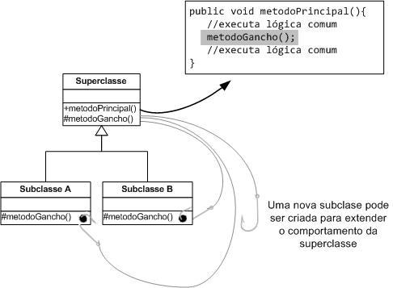

# Hook Methods

Um importante uso que pode ser feito da herança é para permitir a especialização
de comportamento. Dessa forma, a superclasse pode fornecer uma base para uma
determinada funcionalidade, a qual invoca um método que somente é definido pela superclasse. 
Esse método funciona como um ponto de extensão do sistema é chamado de método-gancho, ou em 
inglês, hook method.




A Figura anterior representa o conceito de hook method. A superclasse possui um mé-
todo principal público que é invocado pelos seus clientes. Esse método delega parte
de sua execução para o hook method, que é um método abstrato que deve ser imple-
mentado pela subclasse. Ele funciona como um “gancho” no qual uma nova lógica
de execução para a classe pode ser “pendurada”. Cada subclasse o implementa pro-
vendo uma lógica diferente. Como essa lógica pode ser invocada a partir do mesmo
método público, definido na superclasse, os hook methods permitem que o objeto
possua um comportamento diferente de acordo com a subclasse instanciada.

Um exemplo de uso dessa técnica está na Servlets API, na qual um servlet
precisa estender a classe HTTPServlet . Essa classe possui o método service()
que é invocado toda vez que ele precisa tratar uma requisição HTTP. Esse método
chama outros métodos, como doPost() ou doGet() , que precisam ser imple-
mentados pela subclasse. Neles ela deve inserir a lógica a ser executada para tratar a
requisição recebida. Nesse caso, esses métodos possuem uma implementação default
vazia e precisam ser implementados somente se necessário.

```java
public abstract class Configuration {

    public final void configure(){
        // logica comun
        hookMethod();
        // logica comun
    }

    protected abstract void hookMethod();
}
```

```java
public class ConfigurationPrd extends Configuration {

    protected void hookMethod() {
        System.out.println("Implementando config de PRD");
    }
}
```

```java

public class ConfigurationHlg extends Configuration {
    protected void hookMethod() {
        System.out.println("Implementando config de HLG");
    }
} 

