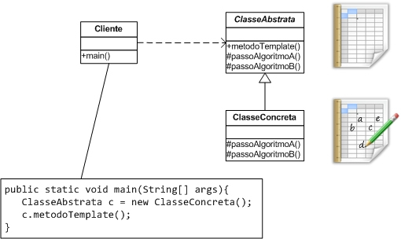

# Template Method

um Template Method é um modelo de algoritmo que possui algumas partes fixas e algumas
partes variáveis. As partes variáveis são lacunas que precisam ser completadas para que
o algoritmo faça realmente sentido. As lacunas são representadas como hook methods que 
podem ser implementados nas subclasses. Caso seja uma lacuna obrigatória, o método deve 
ser definido como abstrato e caso a implementação seja opcional, o método pode ser concreto
e normalmente possui uma implementação vazia. O algoritmo é representado através de um método
na superclasse que coordena a execução dos hook methods.

A Figura a seguir apresenta a estrutura do padrão Template Method . A
ClasseAbstrata representa a superclasse que implementa o TemplateMethod
e que define quais são os hook methods. A ClasseConcreta representa a classe
que herda o Template Method da ClasseAbstrata e define uma implemen-
tação concreta dos hook methods. A classe representada como Cliente invoca o
metodoTemplate() . Observe que apesar do tipo da variável ser do tipo da classe
abstrata, o tipo instanciado é o da subclasse que implementa os passos concretos do
algoritmo.

### Consequências do Uso do Template Method

O uso da herança nesse padrão também traz algumas limitações. A primeira é que a herança
"é uma carta que só pode ser jogada uma vez”, isso significa que uma classe que precise de
comportamentos de duas outras classes só poderá fazer o uso da herança para uma delas.
Outra questão é que depois que uma implementação for instanciada não será mais possível
alterar os passos do algoritmo.
Ao utilizar um padrão, é preciso avaliar para os requisitos de sua aplicação quais
consequências pesam mais ou menos. A partir dessas informações é possível decidir
se seu uso será ou não adequado. Ressalto que o maior problema de uma solução
que possui limitações é quando elas são desconhecidas pelo desenvolvedores, pois
quando se tem consciência de sua existência é possível gerenciar o risco ou tratá-las,
muitas vezes a partir de outros padrões.