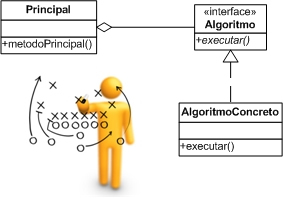
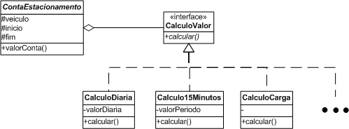

# Padrão Strategy

***Definição:***O Strategy é um padrão que deve ser utilizado quando uma classe possuir
diversos algoritmos que possam ser utilizados de forma intercambiável. ***A solução
proposta pelo padrão consiste em delegar a execução do algoritmo para uma ins-
tância que compõe a classe principal. Dessa forma, quando a funcionalidade for
invocada, no momento de execução do algoritmo, será invocado um método da ins-
tância que a compõe.*** 




### Exemplo de uso do Strategy:



```java
public class ContaEstacionamento {
    private CalculoValor calculo; // Classe que compõe a classe ContaEstacionamento
    private Veiculo veiculo;
    private long inicio;
    private long fim;
    
    public double valorConta() {
       return calculo.calcular(fim-inicio, veiculo);
    }

    public void setCalculo(CalculoValor calculo){
        this.calculo = calculo;
    }
}
```
```java
public interface CalculoValor{
    double calcular();
}
```
A seguir, a classe CalculoDiaria mostra um exemplo de uma classe que faz
o cálculo da tarifa por dia. Observe que essa classe possui um atributo que pode ser
utilizado para parametrizar partes do algoritmo. Dessa forma, quando a estratégia
for alterada para o calculo do valor por dia, basta inserir a instância dessa classe em ContaEstacionamento . Vale também ressaltar que essa mesma classe pode ser
reaproveitada para diferentes empresas em diferentes momentos, evitando assim a
duplicação de código. Essa classe compõe a classe ***ContaEstacionamento.***

```java
public class CalculoDiaria implements CalculoValor {
    private double valorDiaria;
    public CalculoDiaria(double valorDiaria){
        this.valorDiaria = valorDiaria;
    }
    public double calcular() {
        return valorDiaria * Math.ceil(periodo / HORA);
    }
}
```


### O que é composição?

***Definição:*** Uma classe  delega uma determinada lógica para a instância de uma
classe que a compõe. Dessa forma, para trocar um determinado comportamento, 
basta trocar a classe que a está compondo.
           
### O resultado de usar composição

- Em vez de codificar um comportamento estaticamente, definimos pequenos comportamentos padrão e usamos composição para definir comportamentos mais complexos
- De forma geral, a composição é melhor do que herança normalmente, pois:
  - Permite mudar a associação entre classes em tempo de execução;
  - Permite que um objeto assuma mais de um comportamento (ex. papel);
  - Herança acopla as classes demais e engessa o programa;

Links: 

- http://www.inf.pucrs.br/~flash/programming/aula_compostos_java.html#(1)
           

